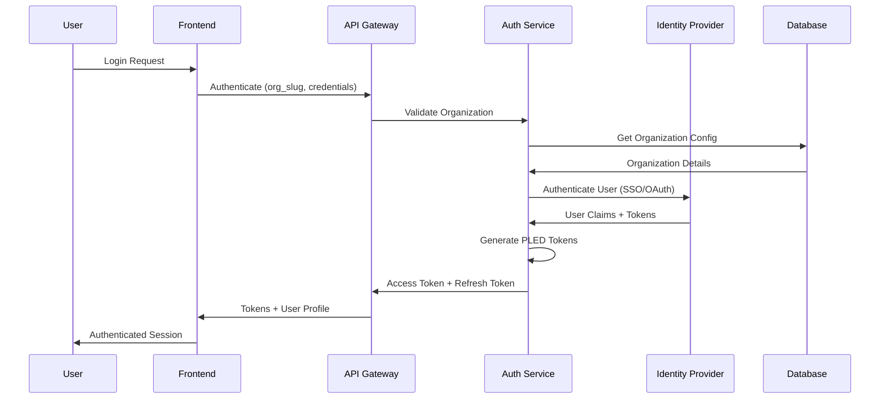

# Security Model Specification

## Overview

This document defines the comprehensive security architecture for PLED, covering authentication, authorization, data protection, audit trails, and compliance requirements for enterprise FSM-based workflow systems.

## Security Principles

### Core Security Tenets

1. **Zero Trust Architecture**: Never trust, always verify
2. **Least Privilege Access**: Grant minimal required permissions
3. **Defense in Depth**: Multiple security layers
4. **Audit Everything**: Comprehensive logging and traceability
5. **Data Sovereignty**: Customer data remains under customer control
6. **Compliance by Design**: Built-in compliance frameworks

### Threat Model

```typescript
interface ThreatModel {
  // External threats
  unauthorizedAccess: {
    vectors: ['credential_theft', 'api_key_exposure', 'session_hijacking'];
    mitigations: ['MFA', 'token_rotation', 'secure_headers'];
  };

  // Internal threats
  privilegeEscalation: {
    vectors: ['rbac_bypass', 'injection_attacks', 'insider_threats'];
    mitigations: ['role_validation', 'input_sanitization', 'activity_monitoring'];
  };

  // Data threats
  dataExfiltration: {
    vectors: ['api_abuse', 'bulk_downloads', 'sql_injection'];
    mitigations: ['rate_limiting', 'access_logging', 'parameterized_queries'];
  };

  // System threats
  serviceDisruption: {
    vectors: ['ddos_attacks', 'resource_exhaustion', 'dependency_failures'];
    mitigations: ['rate_limiting', 'circuit_breakers', 'failover_systems'];
  };
}
```

## Authentication Architecture

### 1. Multi-Tenant Authentication Flow



### 2. Authentication Methods

**OAuth 2.0 / OpenID Connect**
```typescript
interface OAuthConfig {
  // Enterprise SSO providers
  providers: {
    azure_ad: {
      clientId: string;
      clientSecret: string;
      tenantId: string;
      scopes: ['openid', 'email', 'profile'];
    };
    okta: {
      domain: string;
      clientId: string;
      clientSecret: string;
    };
    auth0: {
      domain: string;
      clientId: string;
      clientSecret: string;
    };
  };

  // Token configuration
  tokens: {
    accessTokenTTL: 3600; // 1 hour
    refreshTokenTTL: 604800; // 7 days
    rotateRefreshTokens: true;
  };

  // Security settings
  security: {
    requireMFA: boolean;
    allowedDomains?: string[];
    sessionTimeout: number;
  };
}
```

**API Key Authentication**
```typescript
interface APIKeyConfig {
  // Key types
  types: {
    user_api_key: {
      scopes: ['read', 'write'];
      maxTTL: 90; // days
      rotationRequired: true;
    };
    service_account: {
      scopes: ['read', 'write', 'admin'];
      maxTTL: 365; // days
      ipWhitelist: string[];
    };
    webhook_key: {
      scopes: ['webhook'];
      maxTTL: 365;
      domainRestriction: string;
    };
  };

  // Security policies
  security: {
    keyLength: 32;
    encoding: 'base64url';
    prefix: 'pled_'; // pled_ak_... for API keys
    hashAlgorithm: 'sha256';
    rateLimiting: {
      requestsPerMinute: 1000;
      burstLimit: 100;
    };
  };
}

class APIKeyManager {
  async createAPIKey(
    organizationId: string,
    userId: string,
    type: APIKeyType,
    options: APIKeyOptions
  ): Promise<APIKeyResult> {

    const keyData = {
      id: generateId(),
      organizationId,
      userId,
      type,
      scopes: options.scopes,
      expiresAt: this.calculateExpiry(type, options.ttl),
      ipWhitelist: options.ipWhitelist,
      metadata: options.metadata
    };

    // Generate cryptographically secure key
    const rawKey = crypto.randomBytes(32);
    const keyString = `pled_ak_${base64url.encode(rawKey)}`;
    const keyHash = crypto.createHash('sha256').update(rawKey).digest('hex');

    // Store hashed version only
    await this.storage.storeAPIKey({
      ...keyData,
      keyHash,
      createdAt: Date.now()
    });

    // Return unhashed key only once
    return {
      keyId: keyData.id,
      key: keyString, // Only returned once
      expiresAt: keyData.expiresAt,
      scopes: keyData.scopes
    };
  }

  async validateAPIKey(keyString: string): Promise<APIKeyValidation> {
    try {
      const keyHash = this.hashAPIKey(keyString);
      const keyData = await this.storage.getAPIKeyByHash(keyHash);

      if (!keyData) {
        return { valid: false, reason: 'key_not_found' };
      }

      if (keyData.expiresAt < Date.now()) {
        return { valid: false, reason: 'key_expired' };
      }

      if (keyData.revoked) {
        return { valid: false, reason: 'key_revoked' };
      }

      // Check rate limiting
      const rateLimitOk = await this.checkRateLimit(keyData.id);
      if (!rateLimitOk) {
        return { valid: false, reason: 'rate_limit_exceeded' };
      }

      return {
        valid: true,
        keyData: {
          organizationId: keyData.organizationId,
          userId: keyData.userId,
          scopes: keyData.scopes,
          type: keyData.type
        }
      };

    } catch (error) {
      return { valid: false, reason: 'validation_error' };
    }
  }
}
```

## Authorization Model

### 1. Role-Based Access Control (RBAC)

```typescript
interface RBACModel {
  // Organization-level roles
  organizationRoles: {
    owner: {
      permissions: ['*']; // All permissions
      description: 'Full organization control';
    };
    admin: {
      permissions: [
        'org:read', 'org:write',
        'users:read', 'users:write', 'users:invite',
        'templates:read', 'templates:write', 'templates:delete',
        'executions:read', 'executions:write', 'executions:delete',
        'settings:read', 'settings:write'
      ];
    };
    developer: {
      permissions: [
        'templates:read', 'templates:write',
        'executions:read', 'executions:write',
        'events:read', 'events:write',
        'actions:read', 'actions:write'
      ];
    };
    operator: {
      permissions: [
        'templates:read',
        'executions:read', 'executions:write',
        'events:read', 'events:write',
        'actions:read'
      ];
    };
    viewer: {
      permissions: [
        'templates:read',
        'executions:read',
        'events:read',
        'actions:read'
      ];
    };
  };

  // Resource-specific permissions
  resourcePermissions: {
    'templates': ['read', 'write', 'delete', 'publish'];
    'executions': ['read', 'write', 'delete', 'force_transition'];
    'events': ['read', 'write'];
    'actions': ['read', 'write', 'execute'];
    'rules': ['read', 'write', 'delete', 'test'];
    'users': ['read', 'write', 'invite', 'delete'];
    'org': ['read', 'write'];
    'settings': ['read', 'write'];
    'audit': ['read'];
  };
}

class AuthorizationService {
  async checkPermission(
    userId: string,
    organizationId: string,
    resource: string,
    action: string,
    resourceId?: string
  ): Promise<boolean> {

    // Get user's roles in organization
    const userRoles = await this.getUserRoles(userId, organizationId);

    // Check organization-level permissions
    for (const role of userRoles) {
      const rolePermissions = this.getRolePermissions(role);

      // Check for wildcard permission
      if (rolePermissions.includes('*')) {
        return true;
      }

      // Check for specific permission
      const requiredPermission = `${resource}:${action}`;
      if (rolePermissions.includes(requiredPermission)) {
        // Check resource-specific access if applicable
        if (resourceId) {
          return await this.checkResourceAccess(userId, resource, resourceId);
        }
        return true;
      }
    }

    return false;
  }

  private async checkResourceAccess(
    userId: string,
    resource: string,
    resourceId: string
  ): Promise<boolean> {

    switch (resource) {
      case 'templates':
        // Users can only access templates in their organization
        const template = await this.getTemplate(resourceId);
        return template?.organizationId === await this.getUserOrganization(userId);

      case 'executions':
        // Additional checks for execution access
        const execution = await this.getExecution(resourceId);
        if (!execution) return false;

        // Check if user has access to the template
        return await this.checkResourceAccess(userId, 'templates', execution.templateId);

      default:
        return true;
    }
  }
}
```

### 2. Resource-Level Access Control

```typescript
interface ResourcePolicy {
  resourceType: string;
  resourceId: string;
  organizationId: string;

  // Access control lists
  accessRules: AccessRule[];

  // Inheritance rules
  inheritFrom?: {
    resourceType: string;
    resourceId: string;
  };
}

interface AccessRule {
  principalType: 'user' | 'role' | 'api_key';
  principalId: string;
  permissions: string[];
  conditions?: AccessCondition[];
  expiresAt?: number;
}

interface AccessCondition {
  type: 'ip_whitelist' | 'time_window' | 'mfa_required';
  value: any;
}

class ResourceAccessControl {
  async setResourcePolicy(
    resourceType: string,
    resourceId: string,
    policy: ResourcePolicy
  ): Promise<void> {

    // Validate policy
    await this.validatePolicy(policy);

    // Store policy
    await this.storage.storeResourcePolicy(resourceType, resourceId, policy);

    // Invalidate cache
    await this.cache.invalidate(`policy:${resourceType}:${resourceId}`);
  }

  async checkResourceAccess(
    principal: AuthPrincipal,
    resourceType: string,
    resourceId: string,
    permission: string
  ): Promise<AccessResult> {

    const policy = await this.getResourcePolicy(resourceType, resourceId);

    // Check direct access rules
    for (const rule of policy.accessRules) {
      if (this.matchesPrincipal(rule, principal)) {
        if (rule.permissions.includes(permission) || rule.permissions.includes('*')) {
          // Check conditions
          const conditionResult = await this.evaluateConditions(rule.conditions, principal);
          if (conditionResult.allowed) {
            return { allowed: true, source: 'direct_rule' };
          }
        }
      }
    }

    // Check inherited permissions
    if (policy.inheritFrom) {
      const inheritedResult = await this.checkResourceAccess(
        principal,
        policy.inheritFrom.resourceType,
        policy.inheritFrom.resourceId,
        permission
      );

      if (inheritedResult.allowed) {
        return { allowed: true, source: 'inherited' };
      }
    }

    return { allowed: false, reason: 'no_matching_rule' };
  }
}
```

## Data Protection

### 1. Encryption Strategy

```typescript
interface EncryptionConfig {
  // Encryption at rest
  atRest: {
    database: {
      algorithm: 'AES-256-GCM';
      keyManagement: 'aws-kms' | 'azure-vault' | 'gcp-kms';
      keyRotation: 90; // days
    };
    fileStorage: {
      algorithm: 'AES-256-GCM';
      keyPerFile: true;
    };
  };

  // Encryption in transit
  inTransit: {
    api: {
      protocol: 'TLS 1.3';
      cipherSuites: ['TLS_AES_256_GCM_SHA384', 'TLS_CHACHA20_POLY1305_SHA256'];
      certificateValidation: true;
    };
    internal: {
      protocol: 'mTLS';
      cipherSuites: ['TLS_AES_256_GCM_SHA384'];
    };
  };

  // Field-level encryption for sensitive data
  fieldLevel: {
    piiFields: ['email', 'phone', 'address'];
    sensitiveData: ['api_keys', 'webhook_secrets'];
    algorithm: 'AES-256-GCM';
    keyDerivation: 'PBKDF2';
  };
}

class DataProtectionService {
  private kms: KeyManagementService;

  async encryptSensitiveField(
    organizationId: string,
    fieldName: string,
    value: string
  ): Promise<EncryptedField> {

    // Get organization-specific encryption key
    const encryptionKey = await this.kms.getEncryptionKey(organizationId);

    // Generate unique IV for this field
    const iv = crypto.randomBytes(16);

    // Encrypt the value
    const cipher = crypto.createCipher('aes-256-gcm', encryptionKey);
    cipher.setAAD(Buffer.from(fieldName)); // Additional authenticated data

    let encrypted = cipher.update(value, 'utf8', 'base64');
    encrypted += cipher.final('base64');

    const authTag = cipher.getAuthTag();

    return {
      encryptedValue: encrypted,
      iv: iv.toString('base64'),
      authTag: authTag.toString('base64'),
      algorithm: 'aes-256-gcm',
      keyVersion: encryptionKey.version
    };
  }

  async decryptSensitiveField(
    organizationId: string,
    fieldName: string,
    encryptedField: EncryptedField
  ): Promise<string> {

    const encryptionKey = await this.kms.getEncryptionKey(
      organizationId,
      encryptedField.keyVersion
    );

    const decipher = crypto.createDecipher('aes-256-gcm', encryptionKey);
    decipher.setAAD(Buffer.from(fieldName));
    decipher.setAuthTag(Buffer.from(encryptedField.authTag, 'base64'));

    let decrypted = decipher.update(encryptedField.encryptedValue, 'base64', 'utf8');
    decrypted += decipher.final('utf8');

    return decrypted;
  }
}
```

### 2. Data Loss Prevention (DLP)

```typescript
interface DLPPolicy {
  organizationId: string;
  rules: DLPRule[];
  enforcement: 'monitor' | 'block' | 'redact';
}

interface DLPRule {
  name: string;
  patterns: RegexPattern[];
  categories: ['pii', 'financial', 'healthcare', 'secrets'];
  severity: 'low' | 'medium' | 'high' | 'critical';
  actions: DLPAction[];
}

interface DLPAction {
  type: 'log' | 'alert' | 'block' | 'redact' | 'quarantine';
  configuration: any;
}

class DLPService {
  async scanContent(
    organizationId: string,
    content: string,
    context: ScanContext
  ): Promise<DLPScanResult> {

    const policy = await this.getDLPPolicy(organizationId);
    const violations: DLPViolation[] = [];

    for (const rule of policy.rules) {
      const matches = this.findMatches(content, rule.patterns);

      if (matches.length > 0) {
        violations.push({
          ruleId: rule.name,
          category: rule.categories[0], // Primary category
          severity: rule.severity,
          matches: matches.map(m => ({
            text: m.text,
            position: m.position,
            confidence: m.confidence
          })),
          recommendedActions: rule.actions
        });
      }
    }

    return {
      violations,
      allowed: violations.length === 0 || policy.enforcement === 'monitor',
      processedContent: await this.applyDLPActions(content, violations, policy.enforcement)
    };
  }

  private async applyDLPActions(
    content: string,
    violations: DLPViolation[],
    enforcement: string
  ): Promise<string> {

    if (enforcement === 'redact') {
      let processedContent = content;

      for (const violation of violations) {
        for (const match of violation.matches) {
          // Replace sensitive content with redaction marker
          const redactionMarker = `[REDACTED:${violation.category.toUpperCase()}]`;
          processedContent = processedContent.replace(match.text, redactionMarker);
        }
      }

      return processedContent;
    }

    return content;
  }
}
```

## Audit & Compliance

### 1. Comprehensive Audit Trail

```typescript
interface AuditEvent {
  // Event identification
  id: string;
  timestamp: number;
  organizationId: string;

  // Actor information
  actor: {
    type: 'user' | 'system' | 'api_key';
    id: string;
    displayName?: string;
    ipAddress?: string;
    userAgent?: string;
  };

  // Action details
  action: {
    type: AuditActionType;
    resource: string;
    resourceId?: string;
    method?: string;
    endpoint?: string;
  };

  // Context
  context: {
    sessionId?: string;
    requestId?: string;
    executionId?: string;
    templateId?: string;
  };

  // Outcome
  outcome: {
    success: boolean;
    statusCode?: number;
    errorMessage?: string;
    duration?: number;
  };

  // Data changes
  changes?: {
    before?: Record<string, any>;
    after?: Record<string, any>;
    fields?: string[];
  };

  // Compliance tags
  compliance?: {
    categories: ComplianceCategory[];
    retention: number; // retention period in days
    sensitivity: 'public' | 'internal' | 'confidential' | 'restricted';
  };
}

type AuditActionType =
  | 'authentication'
  | 'authorization'
  | 'data_access'
  | 'data_modification'
  | 'configuration_change'
  | 'user_management'
  | 'system_operation';

type ComplianceCategory =
  | 'gdpr'
  | 'sox'
  | 'hipaa'
  | 'pci_dss'
  | 'iso27001';

class AuditService {
  async logEvent(event: Omit<AuditEvent, 'id' | 'timestamp'>): Promise<void> {
    const auditEvent: AuditEvent = {
      id: generateId(),
      timestamp: Date.now(),
      ...event
    };

    // Store in primary audit log
    await this.storage.storeAuditEvent(auditEvent);

    // Store in compliance-specific logs if required
    if (auditEvent.compliance?.categories) {
      for (const category of auditEvent.compliance.categories) {
        await this.complianceStorage.storeEvent(category, auditEvent);
      }
    }

    // Real-time alerting for critical events
    if (this.isCriticalEvent(auditEvent)) {
      await this.alertService.sendSecurityAlert(auditEvent);
    }
  }

  async generateComplianceReport(
    organizationId: string,
    category: ComplianceCategory,
    startDate: Date,
    endDate: Date
  ): Promise<ComplianceReport> {

    const events = await this.queryAuditEvents({
      organizationId,
      complianceCategory: category,
      startDate,
      endDate
    });

    const analysis = this.analyzeComplianceEvents(events, category);

    return {
      organizationId,
      category,
      period: { start: startDate, end: endDate },
      eventCount: events.length,
      analysis,
      recommendations: this.generateComplianceRecommendations(analysis),
      generatedAt: new Date()
    };
  }
}
```

### 2. Compliance Frameworks

```typescript
interface ComplianceFramework {
  name: ComplianceCategory;
  requirements: ComplianceRequirement[];
  auditFrequency: 'daily' | 'weekly' | 'monthly' | 'quarterly' | 'annually';
  retentionPeriod: number; // days
}

interface ComplianceRequirement {
  id: string;
  title: string;
  description: string;
  controlType: 'preventive' | 'detective' | 'corrective';
  automatedChecks: AutomatedCheck[];
  evidenceTypes: EvidenceType[];
}

const complianceFrameworks: Record<ComplianceCategory, ComplianceFramework> = {
  gdpr: {
    name: 'gdpr',
    requirements: [
      {
        id: 'gdpr_art_32',
        title: 'Security of Processing',
        description: 'Implement appropriate technical and organizational measures',
        controlType: 'preventive',
        automatedChecks: [
          { type: 'encryption_verification', frequency: 'daily' },
          { type: 'access_control_review', frequency: 'weekly' }
        ],
        evidenceTypes: ['encryption_logs', 'access_control_matrix']
      },
      {
        id: 'gdpr_art_17',
        title: 'Right to Erasure',
        description: 'Ability to delete personal data upon request',
        controlType: 'corrective',
        automatedChecks: [
          { type: 'data_deletion_capability', frequency: 'monthly' }
        ],
        evidenceTypes: ['deletion_logs', 'data_inventory']
      }
    ],
    auditFrequency: 'quarterly',
    retentionPeriod: 2555 // 7 years
  },

  sox: {
    name: 'sox',
    requirements: [
      {
        id: 'sox_404',
        title: 'Management Assessment of Internal Controls',
        description: 'Assess internal control over financial reporting',
        controlType: 'detective',
        automatedChecks: [
          { type: 'control_testing', frequency: 'quarterly' },
          { type: 'change_management_review', frequency: 'monthly' }
        ],
        evidenceTypes: ['control_matrices', 'testing_results']
      }
    ],
    auditFrequency: 'quarterly',
    retentionPeriod: 2555 // 7 years
  }
};

class ComplianceManager {
  async assessCompliance(
    organizationId: string,
    frameworks: ComplianceCategory[]
  ): Promise<ComplianceAssessment> {

    const assessments: FrameworkAssessment[] = [];

    for (const framework of frameworks) {
      const frameworkConfig = complianceFrameworks[framework];
      const requirements: RequirementAssessment[] = [];

      for (const requirement of frameworkConfig.requirements) {
        const checks = await this.runAutomatedChecks(
          organizationId,
          requirement.automatedChecks
        );

        const evidence = await this.collectEvidence(
          organizationId,
          requirement.evidenceTypes
        );

        requirements.push({
          requirementId: requirement.id,
          status: this.determineComplianceStatus(checks),
          findings: checks.filter(c => !c.passed),
          evidence,
          lastAssessed: Date.now()
        });
      }

      assessments.push({
        framework,
        overallStatus: this.calculateOverallStatus(requirements),
        requirements,
        nextAssessment: this.calculateNextAssessment(frameworkConfig.auditFrequency)
      });
    }

    return {
      organizationId,
      assessments,
      generatedAt: Date.now()
    };
  }
}
```

## Security Monitoring

### 1. Real-time Security Monitoring

```typescript
interface SecurityEvent {
  id: string;
  timestamp: number;
  severity: 'low' | 'medium' | 'high' | 'critical';
  category: SecurityCategory;
  source: string;
  details: Record<string, any>;
  organizationId?: string;
  userId?: string;
}

type SecurityCategory =
  | 'authentication_failure'
  | 'authorization_violation'
  | 'data_access_anomaly'
  | 'privilege_escalation_attempt'
  | 'suspicious_api_usage'
  | 'potential_data_exfiltration';

class SecurityMonitor {
  private anomalyDetector: AnomalyDetector;
  private alertManager: AlertManager;

  async analyzeSecurityEvent(event: SecurityEvent): Promise<void> {
    // Store the event
    await this.storage.storeSecurityEvent(event);

    // Analyze for anomalies
    const anomalies = await this.anomalyDetector.detectAnomalies(event);

    // Generate alerts if necessary
    if (event.severity === 'critical' || anomalies.length > 0) {
      await this.generateSecurityAlert(event, anomalies);
    }

    // Update security metrics
    await this.updateSecurityMetrics(event);
  }

  private async generateSecurityAlert(
    event: SecurityEvent,
    anomalies: Anomaly[]
  ): Promise<void> {

    const alert: SecurityAlert = {
      id: generateId(),
      eventId: event.id,
      severity: event.severity,
      title: this.generateAlertTitle(event),
      description: this.generateAlertDescription(event, anomalies),
      recommendedActions: this.getRecommendedActions(event.category),
      createdAt: Date.now()
    };

    await this.alertManager.sendAlert(alert);
  }

  async detectSuspiciousPatterns(
    organizationId: string,
    timeWindow: number
  ): Promise<SuspiciousActivity[]> {

    const events = await this.getRecentSecurityEvents(organizationId, timeWindow);
    const patterns: SuspiciousActivity[] = [];

    // Detect multiple failed logins
    const failedLogins = events.filter(e => e.category === 'authentication_failure');
    if (failedLogins.length > 10) {
      patterns.push({
        type: 'brute_force_attempt',
        severity: 'high',
        description: `${failedLogins.length} failed login attempts in ${timeWindow}ms`,
        events: failedLogins.slice(0, 10) // Sample events
      });
    }

    // Detect unusual API usage patterns
    const apiEvents = events.filter(e => e.category === 'suspicious_api_usage');
    const rateLimitViolations = apiEvents.filter(e =>
      e.details.rateLimitExceeded
    );

    if (rateLimitViolations.length > 5) {
      patterns.push({
        type: 'api_abuse',
        severity: 'medium',
        description: 'Multiple rate limit violations detected',
        events: rateLimitViolations
      });
    }

    return patterns;
  }
}
```

### 2. Automated Threat Response

```typescript
interface ThreatResponse {
  triggerCondition: string;
  actions: ResponseAction[];
  severity: 'low' | 'medium' | 'high' | 'critical';
}

interface ResponseAction {
  type: 'block_user' | 'disable_api_key' | 'rate_limit' | 'alert' | 'quarantine';
  configuration: any;
  timeout?: number; // Auto-unblock after timeout
}

const threatResponses: ThreatResponse[] = [
  {
    triggerCondition: 'failed_login_attempts > 5 AND time_window < 300000', // 5 minutes
    actions: [
      {
        type: 'block_user',
        configuration: { duration: 900000 }, // 15 minutes
        timeout: 900000
      },
      {
        type: 'alert',
        configuration: {
          channels: ['security_team'],
          priority: 'high'
        }
      }
    ],
    severity: 'high'
  },
  {
    triggerCondition: 'api_requests > 10000 AND time_window < 60000', // 1 minute
    actions: [
      {
        type: 'rate_limit',
        configuration: {
          limit: 100,
          window: 60000,
          duration: 300000 // 5 minutes
        }
      }
    ],
    severity: 'medium'
  }
];

class AutomatedThreatResponse {
  async evaluateThreatResponses(event: SecurityEvent): Promise<void> {
    for (const response of threatResponses) {
      if (await this.evaluateCondition(response.triggerCondition, event)) {
        await this.executeResponse(response, event);
      }
    }
  }

  private async executeResponse(
    response: ThreatResponse,
    event: SecurityEvent
  ): Promise<void> {

    for (const action of response.actions) {
      try {
        await this.executeAction(action, event);

        // Log the response action
        await this.auditService.logEvent({
          organizationId: event.organizationId,
          actor: { type: 'system', id: 'threat_response' },
          action: {
            type: 'system_operation',
            resource: 'security_response',
            resourceId: action.type
          },
          context: {
            triggerEventId: event.id,
            responseType: action.type
          },
          outcome: { success: true }
        });

      } catch (error) {
        console.error('Failed to execute threat response action:', error);
      }
    }
  }

  private async executeAction(action: ResponseAction, event: SecurityEvent): Promise<void> {
    switch (action.type) {
      case 'block_user':
        if (event.userId) {
          await this.userManager.blockUser(
            event.userId,
            action.configuration.duration,
            `Automated block due to security event: ${event.id}`
          );
        }
        break;

      case 'disable_api_key':
        if (event.details.apiKeyId) {
          await this.apiKeyManager.disableKey(
            event.details.apiKeyId,
            `Automated disable due to security event: ${event.id}`
          );
        }
        break;

      case 'rate_limit':
        await this.rateLimiter.addTemporaryLimit(
          event.source,
          action.configuration.limit,
          action.configuration.window,
          action.configuration.duration
        );
        break;
    }
  }
}
```

This comprehensive security model provides enterprise-grade protection for the PLED platform while maintaining the flexibility needed for FSM-based workflow systems and ensuring compliance with major regulatory frameworks.